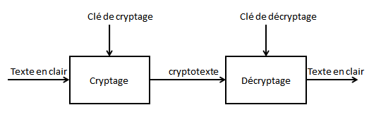

###############################
Introduction à la cryptographie
###############################

..  admonition:: Source
    :class: tip

    Ce document est largement repris du chapitre "Cryptosystèmes" de l'ouvrage TigerJython
    (http://www.tigerjython.ch/franz/index.php?inhalt_links=navigation.inc.php&inhalt_mitte=effizienz/kryptosysteme.inc.php)

Le principe du secret des données joue un rôle de plus en plus important dans
notre société moderne car elle garantit le respect de la vie privée ainsi que la
confidentialité des informations gouvernementales, industrielles ou militaires.
Pour cela, il est nécessaire de crypter les données de telle sorte que si elles
venaient à tomber entre les mains des fausses personnes, il soit impossible ou
du moins très difficile de retrouver l’information originale sans que la méthode
de cryptage soit compromise au préalable.

Durant **l’encodage**, les données originales sont transformées en données
codées et lors du **décodage**, les données originales sont restaurées à partir
des données cryptées. Si les données originales sont constituées de lettres de
l’alphabet, on parle de **texte en clair** et de **cryptotexte**.

La description de la méthode utilisée pour effectuer le décryptage est appelée
**clé** qui peut consister simplement en un nombre, une chaine de caractères
numériques alphabétiques. Si la même clé est utilisée pour le codage et le
décodage, on parle de **système à clé symétrique**. Si, en revanche, les clés de
codage et de décodage sont différentes, on parle de méthode de **cryptographie
asymétrique** (à clé publique).

    Fonctionnement général des algorithmes cryptographiques

..  admonition:: Concepts informatiques
    :class: tip
	
    *   Encodage
    *   décodage
    *   cryptographie symétrique/asymétrique
    *   Chiffre de César
    *   Chiffre de Vigenère
    *   cryptage RSA
    *   clé rivée/publique 

