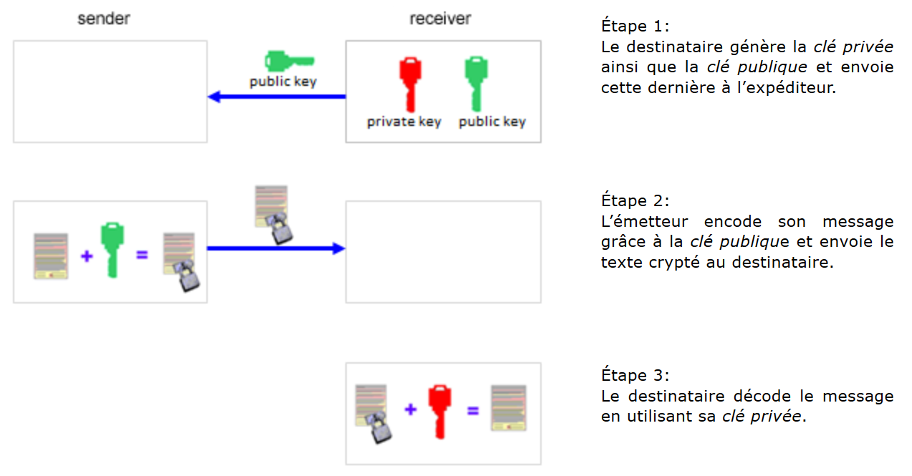

###########
Méthode RSA
###########

Fonctionnement
==============

Dans cette méthode dont le nom provient de celui de ses inventeurs, Rivest,
Shamir et Adleman, on utilise une paire de clés, à savoir une clé privée et une
clé publique. Il s’agit donc d’une méthode de cryptographie asymétrique.

    Fonctionnement du chiffre RSA

..  comment::

    Étape 1: Le destinataire génère la clé privée ainsi que la clé publique et
    envoie cette dernière à l’expéditeur.

    Étape 2: L’émetteur encode son message grâce à la clé publique et envoie le
    texte crypté au destinataire.

    Étape 3: Le destinataire décode le message en utilisant sa clé privée.

Les clés publiques et privées sont générées en utilisant l’algorithme suivant
basé sur des résultats de la théorie des nombres. On en  trouve une preuve
élémentaire dans le livre Barth, *Algorithmics for beginners*, Springer-Verlag.

On commence par choisir deux nombres premiers :math:`p` et :math:`q` qui doivent comporter un très grand nombre de chiffres pour garantir la sécurité du cryptage. On multiplie ensuite ces deux nombres pour obtenir :math:`m = p\cdot q`. On sait de la théorie des nombres que l’indicatrice d’Euler :math:`\phi(m) = (p-1)\cdot (q-1)` correspond au nombre d’entiers :math:`n` inférieurs à :math:`m` qui sont copremiers avec :math:`m`.

..  tip:: 

    Des nombres :math:`a` et :math:`b` sont dits **copremiers** ou **premiers entre eux** si
    :math:`\gcd(m, n) = 1`.

    Le module ``fractions`` de Python permet de calculer le PGDC = GCD (Greatest
    Common Divisor) de deux nombres.

    ..  code-block:: python

        >>> from fractions import gcd
        # 20 et 8 ne sont pas copremiers ...
        >>> gcd(20,8)
        4
        # 10800 et 11 sont copremiers
        >>> gcd(10800, 11)
        1

On choisit ensuite un nombre e inférieur à :math:`\phi(m)` tel que :math:`e` et
:math:`\phi(m)` sont premiers entre eux. La paire de nombres :math:`(m, e)`
constitue déjà la clé publique:

    Clé publique: ``[m, e]``

Exemple
=======

Voici un exemple de calcul de la clé publique pour les petits nombres premiers :math:`p = 73` et :math:`q = 15` :

    *   :math:`m = 73 \cdot  151 = 11023`
    *   :math:`\phi = 72 \cdot  150 = 10800`
    *   :math:`e = 11` (choisi copremier avec :math:`\phi`)

..  admonition:: Clé publique:

    ::
    
        [m, e] = [11023, 11]

La clé privée est quant à elle formée de la paire de nombres:

..  admonition:: Clé privée

    ::
    
        [m, d]

Où :math:`d` est en entier tel que :math:`d \cdot e \pmod \phi = 1`.

(Puisque :math:`e` et :math:`\phi(m)` sont premiers entre eux, l’identité de
Bézout affirme que cette équation possède nécessairement au moins une solution).

On peut déterminer le nombre :math:`d` à partir des valeurs de :math:`e` et
:math:`\phi` à l’aide d’un simple programme qui va tester 100'000 valeurs pour
:math:`d` au sein d’une boucle:

..  code-block:: python
    :linenos:

    e = 11
    phi = 10800

    for d in range(100000):
        if  (d * e) % phi == 1:
            print "d", d

On obtient ainsi plusieurs solutions : (5891, 16691, 27491, 49091, etc.). Comme
il suffit d’une seule valeur pour déterminer la clé privée, la première
rencontrée fait l’affaire.

..  admonition:: Clé privée

    ::
    
        [m, d] = [11023, 5891]

..  admonition:: Sécurité de RSA
    :class: warning

    Dans le cas présent, il est très facile de déterminer la clé privée uniquement à
    cause du fait que l’on connaît les nombres premiers :math:`p` et :math:`q` et,
    de ce fait, la valeur de :math:`\phi`. Cependant, sans la connaissance de ces
    nombres, il faut une puissance de calcul énorme pour calculer la clé privée.

Encodage de textes
==================

L’algorithme RSA est utilisé pour encoder des nombres. Pour encoder du texte, on
utilise donc le code ASCII de chacun des caractères du message en clair qui sera
crypté à l’aide de la clé publique ``[m, s]`` selon la formule

    ..  math::

        s = r^e \pmod m.

Le programme suivant écrit chacun des caractères encodés sur une nouvelle ligne
dans le fichier ``secret.txt``.

..  code-block:: python
    :linenos:

    publicKey = [11023, 11]

    def encode(text):
        m = publicKey[0]
        e = publicKey[1]
        enc = ""
        for ch in text:
            r = ord(ch)
            s = int(r**e % m)
            enc += str(s) + "\n"
        return enc

    fInp = open("original.txt")
    text = fInp.read()
    fInp.close() 

    print "Original:\n", text
    krypto = encode(text)
    print "Krypto:\n", krypto

    fOut = open("secret.txt", "w")
    for ch in krypto:
        fOut.write(ch)
    fOut.close()

Le décodeur commence par charger ligne à ligne les nombres présents dans le
fichier ``secret.txt`` pour les stocker dans une liste. Pour chacun des nombres
présents dans cette liste, le nombre original est calculé à l’aide de la clé
privée :math:`s` selon la formule

..  math::

    r = s^d \pmod m.

Ce nombre correspond au code ASCII du caractère original.

..  code-block:: python
    :linenos:
        
    privateKey = [11023, 5891]

    def decode(li):
        m = privateKey[0]
        d = privateKey[1]
        enc = ""
        for c in li:
            s = int(c)
            r = s**d % m
            enc += chr(r)
        return enc

    fInp = open("secret.txt")
    krypto = []
    while True:
    line = fInp.readline().rstrip("\n")
    if line == "":
        break
    krypto.append(line)
    fInp.close() 

    print "Krypto:\n", krypto
    msg = decode(krypto)
    print "Message:\n", msg

    fOut = open("message.txt", "w")    
    for ch in msg:
        fOut.write(ch)
    fOut.close()    
 
  	 
  	
	
..  admonition:: Memento
    :class: warning
  	

    Le gros avantage du code RSA réside dans le fait que l’émetteur et le
    récepteur n’ont pas besoin de procéder à un échange d’information secrète
    avant de procéder au cryptage. Au lieu de cela, le destinataire génère la
    clé privée et la clé publique et ne transmet que la clé publique à
    l’émetteur tout en gardant bien au chaud sa clé privée. L’émetteur va alors
    crypter son message à l’aide de la clé publique du destinataire en sachant
    que seul le destinataire sera capable de décrypter le message puisqu’il est
    le seul à disposer de la clé privée nécessaire à cette opération [plus... ].

    En pratique, on choisit de très gros nombres premiers :math:`p` et :math:`q`
    comportant des centaines de chiffres. Générer la clé publique ne nécessite
    que le produit :math:`m = p \cdot q`, ce qui est une banalité pour
    l’ordinateur. Si un pirate veut déterminer la clé privée à partir de la clé
    publique, il lui faut déterminer les nombres premiers originaux :math:`p` et
    :math:`q` à partir de :math:`m`, ce qui revient à factoriser le nombre m en
    ses deux facteurs premiers. Or, la factorisation de très grands nombres
    premiers n’est à ce jour possible qu’en utilisant une puissance de calcul
    absolument colossale. On voit de ce fait que le cryptosystème RSA repose sur
    les limites de la calculabilité. Il ne faut cependant jamais oublier qu’il
    n’existe en principe aucune méthode de cryptage parfaitement incassable.
    Heureusement, il suffit que l’opération de décryptage soit considérablement
    plus longue que la période de validité ou de pertinence de l’information
    pour que la méthode soit considérée comme étant suffisamment sûre.

Compléments
===========

Il faut noter quelques compléments par rapport au chiffre présenté
ci-dessus.

*   La méthode RSA, telle que présentée ci-dessus, n'est pas considérée
    comme sûre car deux messages vont toujours donner lieu au même cryptotexte.
    En pratique, on utilise encore des techniques de modification du texte à crypter avant de le crypter (padding OAEP).

*   On n'utilise rarement RSA pour crypter de longs textes. L'avantage de
    RSA est de ne pas nécessiter d'échange de la clé de cryptage. Son
    désavantage est d'être relativement coûteux en temps de calcul pour le
    cryptage et le décryptage. En pratique, on utilise des méthodes symétriques
    pour crypter de grandes quantités de données (méthode AES). Seule la clé de
    cryptage / décryptage symétrique est à ce moment transférée de manière
    sécurisée par RSA.

..  warning::

    Il ne faut jamais tenter d'implémenter soi-même un algorithme
    cryptographique "maison" à moins d'être un très grand spécialiste du sujet.
    Même s'il est relativement facile de comprendre le principe de base du
    fonctionnement de RSA ou AES, le diable se cache dans les détails
    d'implémentation des algorithmes.

    En pratique, des communications cryptées avec RSA ou d'autres protocoles
    cryptographiques modernes et considérés comme sécurisées ont déjà été
    compromises en raison de faiblesses d'implémentation et de programmation.

    Voici l'une des plus célèbres vulnérabilités détectée dans le protocole
    OpenSSL et publiée en mars 2012. Elle a affecté gravement la sécurité de
    plusieurs sites Internet majeurs pendant plusieurs mois :
    https://fr.wikipedia.org/wiki/Heartbleed.

    En résumé, il est conseillé de toujours utiliser une bibliothèque
    cryptographique éprouvée et testée de manière extensive par la communauté.
    Python met à disposition de telles bibliothèques au travers du module
    ``pycrypto`` (https://pypi.python.org/pypi/pycrypto).

Exercices
=========

#.  Expliquer comment l'on peut utiliser RSA pour signer électroniquement des
    documents.

#.  Utiliser la méthode RSA pour générer une clé publique et une clé privée à
    l’aide de deux nombres premiers :math:`p` et :math:`q` tous deux inférieurs à 100 et procéder au
    cryptage / décryptage d’un message de votre choix

#.  Alice intercepte une communication contenant la clé publique de Bob : ``[m, e] = [97213511, 6551]``. 
    Malheureusement, Bob n'a pas bien suivi le cours d'OC et a
    implémenté lui-même son algorithme RSA en utilisant des nombres premiers trop
    petits pour générer sa paire de clés. Aidez Alice à retrouver la clé privée de
    Bob et à décoder le message suivant qui a été encodé avec cette clé publique :

    ..  only:: html

        ::

            55243745
            51526215
            95847954
            53939537
            38094322
            10124798
            38094322
            40971800
            38240142
            95847954
            58239852
            40971800
            51526215
            44886782
            95847954
            86777902
            40971800
            53939537
            95847954
            35732080
            71148358
            95847954
            40971800
            30464285
            95847954
            56277559
            38094322
            30464285
            30464285
            38094322
            40971800
            53939537
            95847954
            80549232
            4320698
            51526215
            44886782
            86777902
            4320698
            51526215
            95847954
            86777902
            51526215
            38240142
            95847954
            44886782
            66353483
            61142710
            58239852
            4320698
            51526215
            38240142
            95847954
            80549232
            4320698
            51526215
            61142710
            40971800
            51526215
            4320698
            38240142
            39260563
            53939537
            4320698
            51526215
            38240142
            95847954
            85232795
            4320698
            38094322
            44886782
            86777902
            38240142
            95847954
            80549232
            66353483
            71148358
            4320698
            95847954
            35732080
            71148358
            51526215
            95847954
            44886782
            66353483
            38240142
            95847954
            61142710
            51526215
            38240142
            38240142
            38094322
            85232795
            51526215
            38240142
            95847954
            44886782
            51526215
            95847954
            38240142
            66353483
            40971800
            51526215
            44886782
            53939537
            95847954
            80549232
            38094322
            38240142
            95847954
            86777902
            51526215
            53092658
            66353483
            71148358
            10124798
            51526215
            4320698
            53939537
            38240142
            39260563
            51526215
            44886782
            95847954
            80549232
            30464285
            71148358
            38240142
            95847954
            40971800
            30464285
            95847954
            56277559
            38094322
            71148358
            53939537
            95847954
            51526215
            44886782
            53092658
            66353483
            4320698
            51526215
            95847954
            53092658
            63093923
            66353483
            40971800
            38240142
            40971800
            4320698
            95847954
            86777902
            51526215
            38240142
            95847954
            44886782
            66353483
            61142710
            58239852
            4320698
            51526215
            38240142
            95847954
            80549232
            4320698
            51526215
            61142710
            40971800
            51526215
            4320698
            38240142
            95847954
            35732080
            71148358
            40971800
            95847954
            44886782
            51526215
            95847954
            38240142
            66353483
            44886782
            53939537
            95847954
            80549232
            38094322
            38240142
            95847954
            80549232
            4320698
            66353483
            53092658
            63093923
            51526215
            38240142
            95847954
            30464285
            71148358
            44886782
            95847954
            86777902
            51526215
            95847954
            30464285
            38094322
            71148358
            53939537
            4320698
            51526215
            39260563
            58239852
            66353483
            58239852

    ..  only:: latex

        ..  tip::

            Le texte crypté figure uniquement sur le site car il prendrait trop de place dans ce document vu que chaque nombre est codé sur une ligne séparée.

#.  Expliquez comment l'on fait en pratique pour choisir des nombres premiers :math:`p` et :math:`q`
    très grands et les conditions que ces nombres doivent respecter.

    ..  tip::

        Mot clé : tests de primalité probabilistes, test de Miller-Rabin

