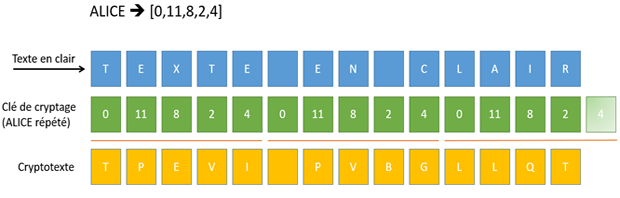

###################
Chiffre de Vigenère
###################
        
Il est possible de renforcer le chiffre de César en appliquant un décalage
alphabétique différent pour chacun des caractères du texte en clair. Cette
substitution poly-alphabétique peut utiliser comme clé n’importe quelle
permutation de 27 nombres. Il existe donc un nombre phénoménal de clés
possibles, à savoir

..  math::

    27! = 10'888'869'450'418'352'160'768'000'000 \approx 10^{27}

..  only:: html

    ..  sidebar:: Blaise Vigenère (1523 - 1596)

        ..  figure:: figures/vigenere-portrait.png
            :align: center
            :width: 95%

            Blaise Vigenère (1523 - 1596)

..  only:: latex

    ..  figure:: figures/vigenere-portrait.png
        :align: center
        :width: 20%

        Blaise Vigenère (1523 - 1596)

Il est cependant un peu plus aisé d’utiliser un mot secret auquel on fait
correspondre une liste de nombres correspondant à la position de chacun de ses
caractères dans l’alphabet. Ainsi, le mot secret ALICE correspond à la liste
``[0, 11, 8, 2, 4]``. La clé de cryptage, de même longueur que le message à
crypter, est construite à partir d’une juxtaposition répétée des décalages ``[0,
11, 8, 2, 4]`` correspondant au mot secret ALICE. Lors de l’encodage, les
caractères du texte en clair sont décalés selon le nombre correspondant de la
clé de cryptage.

..  raw:: html

    

L’illustration suivante permet de mieux comprendre le fonctionnement de la
méthode de Vigenère:

    Fonctionnement du chiffre de Vigenère

Et voici le code permettant d'encoder un texte lu depuis le fichier ``original.txt`` :
    
..  code-block:: python
    :linenos:
        
    import string
    key = "ALICE"
    alphabet = string.ascii_uppercase + " " 

    def encode(text):
        keyList = []
        for ch in key:
            i = alphabet.index(ch)
            keyList.append(i)
        print "keyList:", keyList
        enc = ""
        for n in range(len(text)):
            ch = text[n]
            if ch != "\n":
                i = alphabet.index(ch)  
                k = n % len(key)                
                ch = alphabet[(i + keyList[k]) % 27]      
            enc += ch
        return enc

    fInp = open("original.txt")
    text = fInp.read()
    fInp.close() 

    print "Original:\n", text
    krypto = encode(text)
    print "Krypto:\n", krypto

    fOut = open("secret.txt", "w")    
    for ch in krypto:
        fOut.write(ch)
    fOut.close()

 	

Le décodeur est à nouveau pratiquement identique à l’encodeur excepté le sens de décalage.

    
..  code-block:: python
    :linenos:
        
    import string
    key = "ALICE"
    alphabet = string.ascii_uppercase + " " 

    def decode(text):
        keyList = []
        for ch in key:
            i = alphabet.index(ch)
            keyList.append(i)
        print "keyList:", keyList
        enc = ""
        for n in range(len(text)):
            ch = text[n]
            if ch != "\n":
                i = alphabet.index(ch)
                k = n % len(key)
                ch = alphabet[(i - keyList[k]) % 27]
            enc += ch
        return enc

    fInp = open("secret.txt")
    krypto = fInp.read()
    fInp.close() 

    print "Krypto:\n", krypto
    msg = decode(krypto)
    print "Message:\n", msg

    fOut = open("message.txt", "w")
    for ch in msg:
        fOut.write(ch)
    fOut.close()

  	
	
..  admonition:: Memento
    :class: warning

    Le chiffre de Vigenère fut inventé au 16e siècle par Blaise de Vigenère et
    fut considéré comme très sûr pendant de nombreux siècles. Si quelqu’un entre
    en possession du cryptotexte et sait que la longueur du mot secret est 5, il
    lui faut néanmoins essayer systématiquement :math:`26^5  = 11'881'376` clés
    différentes à moins qu’il connaisse une information supplémentaire au sujet
    du mot secret, comme le fait qu’il s’agit d’un prénom féminin.

Exercices 
=========

1.  Expliquer en quoi le chiffre de César est un cas particulier de chiffre de Vigenère.

2.  Faire une recherche sur le Web concernant le système de cryptage Skytale et
    implémenter un encodeur / décodeur basé sur ce principe.

3.  Expliquer ce qu'est l'analyse de fréquence et comment cette méthode peut
    être utilisée pour casser le code de Vigenère si l'on connaît la langue dans
    laquelle est écrit le message original.

4.  Expliquer pourquoi le chiffre de Vigenère n'est pas considéré comme sûr du
    tout actuellement.